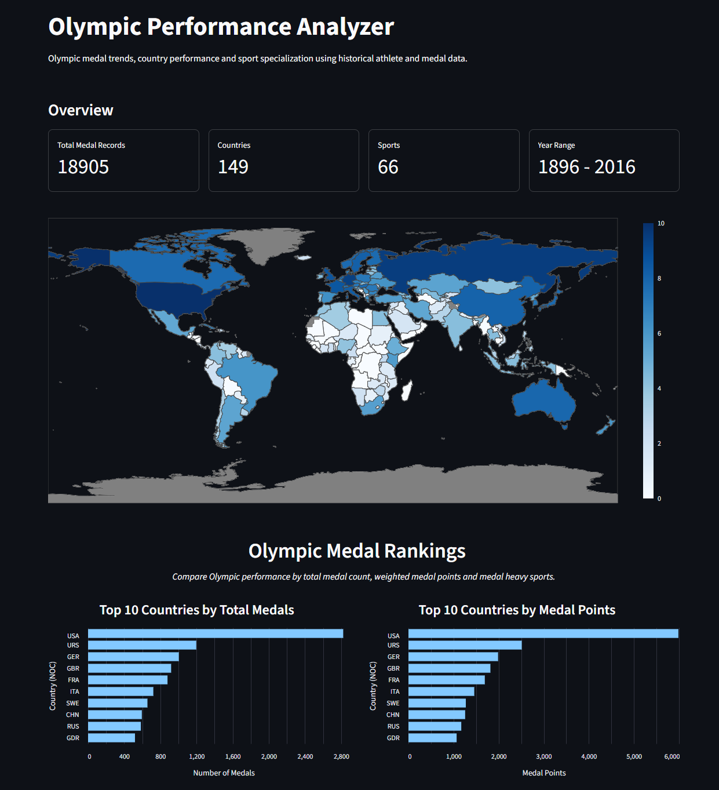
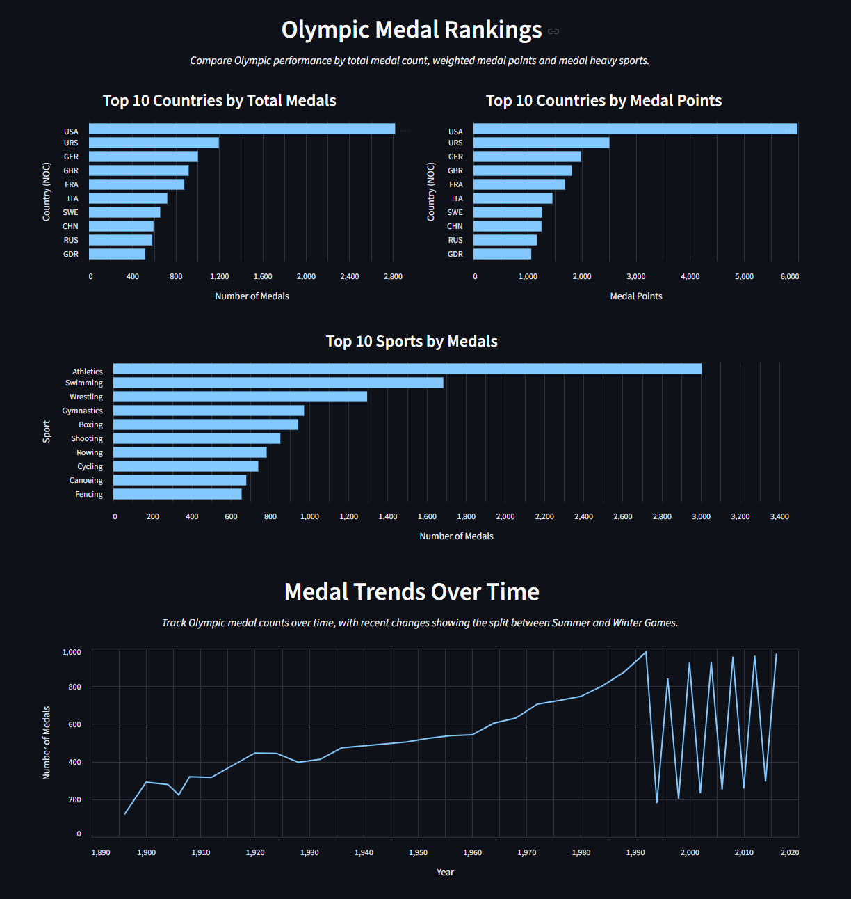
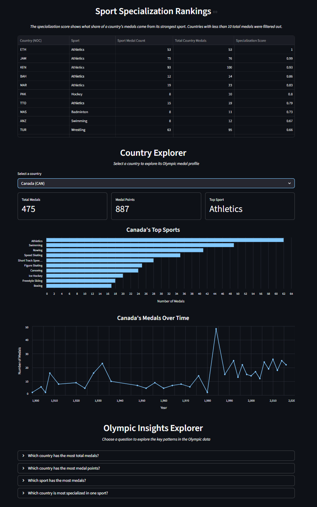

# Olympic Performance Analyzer

This project analyzes historical Olympic athlete and medal data to find patterns in country performance, medal trends and sport specialization. The goal of the project was to answer questions such as "which countries perform best overall", "which sports produce the most medals" and "which countries rely most on one specific sport".

## Live Demo

[View the deployed Streamlit dashboard](https://olympic-performance-analyzer.streamlit.app/)

## Project Overview 

I used Python, pandas, NumPy, Streamlit, Plotly and Altair to clean, analyze and visualize the Olympic data in an interactive dashboard. 

This project includes: 
  - Cleaning and filtering Olympic athlete records
  - Removing duplicate medal records from team events
  - Ranking countries by total medals
  - Creating a weighted medal points system
  - Analyzing medal trends over time
  - Measuring country sport specialization
  - Mapping Olympic NOC codes to ISO country codes for the choropleth map
  - Building an interactive Streamlit dashboard
  - Adding a Country Explorer for country-specific Olympic profiles
  - Adding an Olympic Insights Explorer for guided questions
  - Adding sidebar navigation for dashboard sections
  
## Dataset 

The project uses two CSV files: 
  - `athlete_events.csv`
  - `noc_regions.csv`

The raw data is stored in: 
  - `data/raw/`

The processed data is stored in: 
  - `data/processed/`

## Data Cleaning 

The original dataset is athlete-based which means that team events can create duplicate medal rows. For example, one team medal may appear once for every athlete on that team. 

To avoid overcounting medals, I created a deduplicated medal dataset using columns such as year, sport, event, country code and medal type. 

This reduced the medal records from about 39,000+ athlete level medal rows to about 18,000+ unique medal results. 

## What I Analyzed 

The main questions that I explored were: 
  - Which countries have won the most Olympic medals?
  - How do rankings change when gold, silver and bronze medals are weighted differently?
  - Which sports have produced the most medals?
  - How have medal counts changed over time?
  - Which countries are most specialized in one sport?
  - What is each country's strongest Olympic sport?

## Dashboard Features

The Streamlit dashboard includes: 
  - Overview metrics for total medal records, countries, sports and year range
  - Interactive world choropleth map showing medal intensity by country
  - Country medal rankings by total medals and weighted medal points
  - Top sports by total medals
  - Medal trends over time
  - Sport specialization rankings
  - Country Explorer for selecting a specific country and viewing its Olympic profile
  - Olympic Insights Explorer with guided questions
  - Sidebar navigation for jumping between dashboard sections

## Custom Scoring

### Medal Points 

I used a simple point system to give more weight to higher medal finishes: 
  - Gold = 3 points
  - Silver = 2 points
  - Bronze = 1 point

This gives a different way to look at the total medal count because countries with more gold medals score higher. 

### Sport Specialization Score

I created a specialization score to measure how much of a country's medal success comes from one sport. 
  - Specialization Score: Sport Medal Count / Total Country Medals

For example, if a country has 100 total medals and 60 came from Athletics, then its Athletics specialization score would be: 60 / 100 = 0.60. This means that 60% of that country's medals came from Athletics. In order to make the ranking more useful, I filtered out countries with less than 10 total medals. Countries with 1 or 2 medals can easily have a score of 1.0 which makes the results misleading. 

### Medal Intensity 

For the choropleth map, I used a log-scaled medal intensity score from 0-10. This makes the map easier to read because a few countries have much higher medal totals than most others. 

The map hover still shows the real total medals and medal points. 

## Key Findings

The United States had the highest total medal count and medal points in the dataset. Other countries such as the Soviet Union, Germany, Great Britain, France and Italy also ranked near the top. 

Athletics showed up more often as the strongest sport for highly specialized countries. Countries such as Ethiopia, Jamaica, Kenya, Bahamas and Morocco, Trinidad and Tobago, Nigeria and Algeria all had Athletics as their top sport. 

The specialization analysis showed that total medals do not explain everything. Some countries may not have the highest medal totals overall but they can still be very strong in one specific sport.

## Project Structure

```
data/raw/              Original dataset files
data/processed/        Cleaned data and summary tables used by the dashboard
notebooks/             Jupyter notebook containing the analysis workflow
outputs/charts/        Saved chart images from earlier analysis
utils/                 Helper files such as country code mappings
app.py                 Streamlit dashboard application
requirements.txt       Python libraries needed to run the project
```

## How to Run

  1. Install the required libraries: `pip install -r requirements.txt`
  2. Run the Streamlit dashboard: `streamlit run app.py`
  3. To view the analysis notebooke, open: `notebooks/olympics_analysis.ipynb`, then run all cells from top to bottom. 

## Screenshots

### Overview and Medal Map


### Medal Rankings and Trends


### Sport Specialization, Country Explorer and Insights Explorer


## Future Improvements 
  - Separating Summer and Winter Olympics for cleaner analysis
  - Adding population data for fairer country comparisons
  - Adding more advanced filters for year, sport, medal type and country
  - Adding more detailed country-level medal breakdowns


